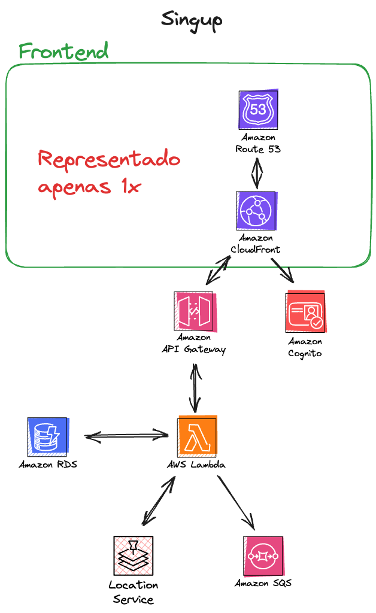
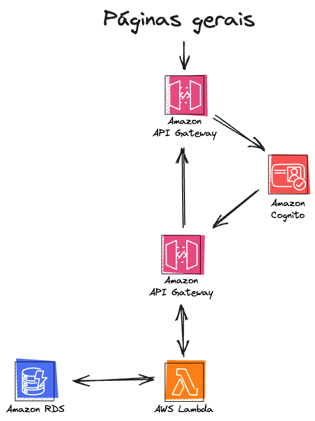
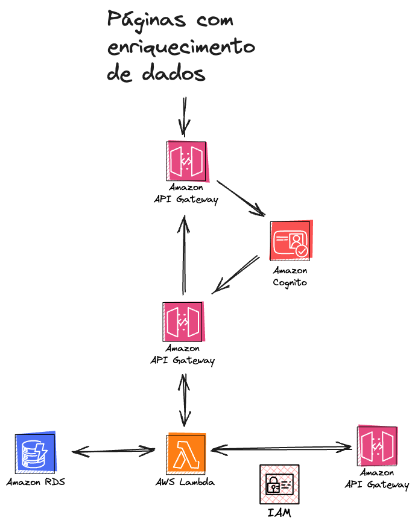
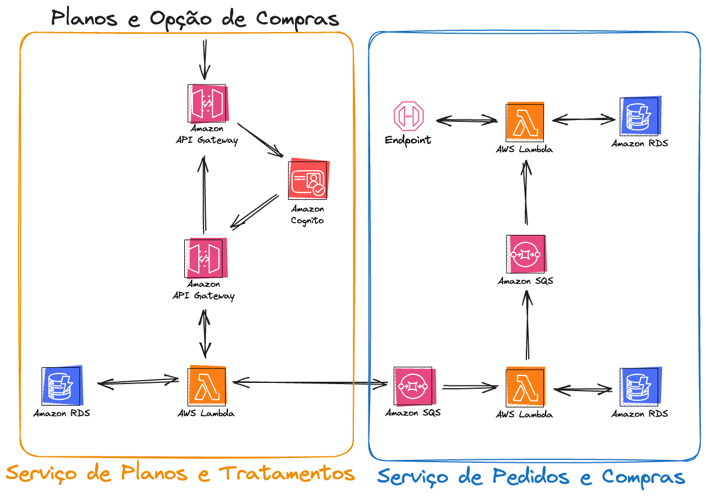
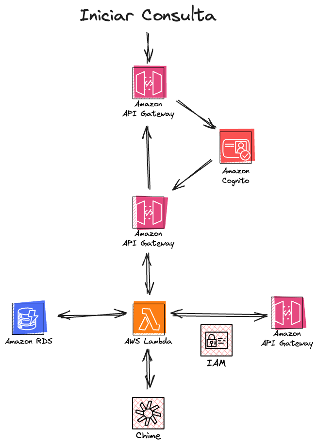
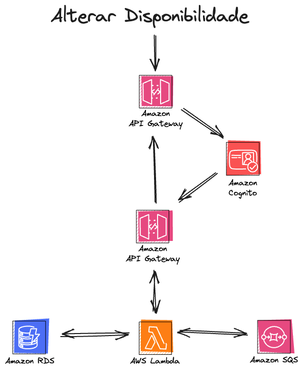
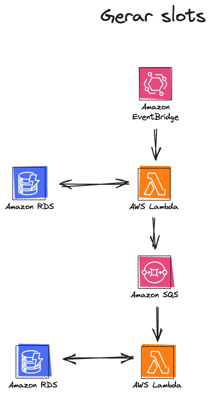
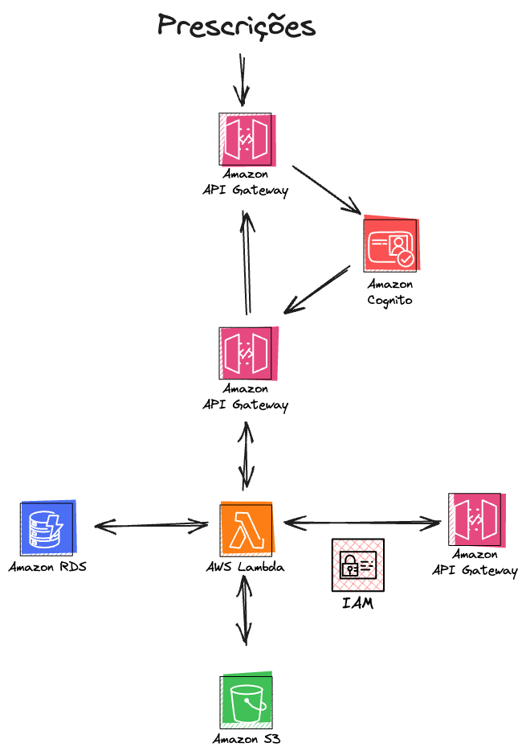

# Sistema Multissetorial de Saúde em Nuvem

Este repositório contém o código-fonte e a documentação para o **Sistema Multissetorial de Saúde em Nuvem**, uma plataforma digital desenvolvida como Trabalho de Conclusão de Curso (TCC) no Departamento de Engenharia de Computação e Sistemas Digitais da Escola Politécnica da Universidade de São Paulo (USP).

## Visão Geral

O **Sistema Multissetorial de Saúde em Nuvem** é uma plataforma web que visa integrar e centralizar variados serviços de saúde, facilitando o acesso e a gestão de informações para pacientes, profissionais da saúde e empresas parceiras. O sistema foi projetado para ser modular, escalável e seguro, utilizando uma arquitetura de microsserviços e tecnologias de computação em nuvem.

## Objetivos

O principal objetivo deste projeto é desenvolver uma plataforma que:

- Forneça uma interface unificada para o gerenciamento de saúde, integrando agendamento de consultas, telemedicina, registros de históricos médicos e acompanhamento de tratamentos.
	
- Facilite a comunicação e a troca de informações entre pacientes, profissionais da saúde e empresas parceiras.
	
	
- Garanta a segurança e a privacidade dos dados dos usuários, em conformidade com a **Lei Geral de Proteção de Dados (LGPD)**.
- Ofereça uma arquitetura escalável e flexível, capaz de se adaptar às crescentes demandas e às evoluções tecnológicas e regulatórias do setor de saúde.
- Implemente a facilitação de compras com parceiros como mercados, farmácias, lojas de esportes, academias e hospitais parceiros.
	

## Funcionalidades Principais

### Pacientes

- **Dashboard:** Visão geral de compromissos, planos de tratamento ativos e notificações.
- **Agendamento de Consultas e Exames:** Ferramenta para agendar consultas com profissionais e exames em hospitais parceiros.
- **Meus Atendimentos:** Lista de consultas e exames agendados, com opções para visualizar detalhes, remarcar ou cancelar.
- **Opções de Compras:** Visualização de planos de tratamento com opções de compra disponíveis (integração com parceiros).
- **Minhas Compras:** Acompanhamento do status dos pedidos realizados.
- **Histórico de Saúde:** Acesso a avaliações, planos de tratamento e documentos médicos.
- **Mensagens:** Comunicação direta com profissionais de saúde através de videochamada.

- **Pagamentos:** Realização de pagamentos e acesso ao histórico financeiro.

### Profissionais de Saúde

- **Minha Agenda:** Gerenciamento de disponibilidade e visualização de atendimentos agendados.
	
	
- **Planos de Tratamento:** Criação e gerenciamento de planos de tratamento personalizados.
- **Avaliações:** Criação e gerenciamento de avaliações detalhadas e simplificadas dos pacientes.
- **Pacientes Atendidos:** Acesso ao histórico de consultas, avaliações e planos de tratamento de pacientes atendidos.
- **Mensagens:** Comunicação direta com pacientes através de chat e videochamada.
- **Prescrições:** Criação e emissão de prescrições médicas.
	

### Empresas Parceiras

- **Pedidos:** Visualização e gerenciamento de pedidos recebidos através da plataforma.
- **Integração API:** Gerenciamento da integração via API, incluindo chaves de acesso e configuração de endpoints.
- **Perfil da Empresa:** Atualização de dados da empresa e gerenciamento de usuários associados.

#### Tipos de Empresas Parceiras

- Hospitais
- Mercados
- Farmácias
- Lojas de Esportes
- Academias

## Tecnologias Utilizadas

- **Backend:** Python com AWS Lambda para microsserviços.
- **Frontend:** React com Chakra UI e Material UI.
- **Banco de Dados:** Amazon RDS (PostgreSQL) para armazenamento de dados relacionais.
- **Armazenamento de Arquivos:** Amazon S3 para armazenamento de documentos e imagens.
- **Comunicação:**
  - Amazon API Gateway para gerenciamento de APIs.
  - WebRTC e AWS Chime para videochamadas.
  - Amazon SQS para enfileiramento de mensagens.
- **Autenticação e Autorização:** AWS Cognito com JWT (JSON Web Tokens).
- **Segurança:**
  - Criptografia em trânsito (HTTPS) com Amazon CloudFront e Route 53.
  - Criptografia em repouso com AWS KMS.
  - Conformidade com a LGPD.
- **Outros Serviços AWS:**
  - AWS EventBridge para agendamento de tarefas.
  - AWS Lambda Layers para gerenciamento de dependências.
  - AWS Location Service para validação de endereços e geolocalização.
  - AWS VPC (Virtual Private Cloud) para isolamento de rede (parcialmente implementado).
  - AWS CloudWatch para monitoramento e logs.

## Arquitetura

O sistema é baseado em uma arquitetura de microsserviços, onde cada funcionalidade é implementada como um serviço independente. As camadas da arquitetura incluem:

1. **Camada de Visualização (Front-End):** Interfaces gráficas para interação com os usuários, incluindo portais para pacientes, profissionais e empresas.
2. **Camada de Serviços e Processamento (Back-End):** Microsserviços implementados com AWS Lambda, responsáveis pela lógica de negócios e processamento das requisições.
3. **Camada Lógica (Infraestrutura):** Serviços de infraestrutura em nuvem, incluindo bancos de dados, servidores, redes, API Gateway e comunicação em tempo real.